# CivicHalo complete production workflow

Green nodes are implemented and verified. Yellow nodes are not yet implemented or still require production certification. The diagram background is explicitly white.

```mermaid
%%{init: {
  "theme": "base",
  "themeVariables": {
    "background": "#ffffff",
    "mainBkg": "#ffffff",
    "primaryTextColor": "#111111",
    "lineColor": "#333333",
    "fontFamily": "Arial"
  },
  "flowchart": { "curve": "basis", "htmlLabels": true }
}}%%
flowchart TB
    LEGEND_OK["COMPLETED / WORKING"]
    LEGEND_PENDING["NOT IMPLEMENTED / PENDING"]

    subgraph CLIENT["1 · User, frontend, and sign-in"]
        USER["Analyst, reviewer, or tenant admin"]
        VERCEL["Vercel production<br/>React 19 + TypeScript + Vite<br/>civichalo.vercel.app"]
        COGNITO["Amazon Cognito managed sign-in<br/>Authorization Code + PKCE"]
        JWT["Signed ID token<br/>tenant memberships + roles"]
        MAPUI["MapLibre GL + h3-js<br/>forecast and source-location maps"]
        OPENMAP["OpenFreeMap vector basemap<br/>no browser API key"]

        USER -->|"Open application"| VERCEL
        VERCEL -->|"Redirect to secure sign-in"| COGNITO
        COGNITO -->|"Return one-time authorization code"| VERCEL
        VERCEL -->|"PKCE code exchange"| JWT
        VERCEL --> MAPUI
        MAPUI --> OPENMAP
    end

    subgraph EDGE["2 · Public HTTPS and private AWS entry path"]
        APIGW["Amazon API Gateway<br/>public HTTPS endpoint + TLS"]
        VPCLINK["API Gateway VPC Link"]
        ALB["Internal Application Load Balancer<br/>VM is not directly public"]
        SG["Security groups<br/>only required service paths"]

        VERCEL -->|"HTTPS + Bearer ID token"| APIGW
        APIGW --> VPCLINK --> ALB --> SG
    end

    subgraph COMPUTE["3 · AWS compute and application boundary"]
        EC2["Amazon EC2 review VM<br/>managed through AWS Systems Manager"]
        DOCKER["Docker Compose production stack"]
        API["FastAPI + Uvicorn API replicas<br/>request IDs, typed errors, limits"]
        AUTH["OIDC signature, issuer, audience,<br/>tenant membership and role checks"]
        TENANT{"Authorized for active tenant?"}
        DENY["Return 401 / 403<br/>no tenant data disclosed"]
        CLAM["ClamAV + freshclam<br/>malware scan and signature updates"]
        WUPLOAD["Upload worker"]
        WINDEX["Index worker"]
        WANALYZE["Analysis worker"]
        WDELETE["Retention/delete worker"]

        SG --> EC2 --> DOCKER
        DOCKER --> API
        DOCKER --> CLAM
        DOCKER --> WUPLOAD
        DOCKER --> WINDEX
        DOCKER --> WANALYZE
        DOCKER --> WDELETE
        API --> AUTH --> TENANT
        TENANT -->|"No"| DENY
    end

    subgraph SOURCEFLOW["4 · Source registration, location, and video intake"]
        SOURCES["Register or list recorded-video sources"]
        LOCATION["Click Show map location"]
        LOCSECRET["AWS Secrets Manager<br/>restricted camera coordinates"]
        H3LOCATION["Backend converts coordinates to H3 resolution 8<br/>returns cell ID only"]
        SOURCEHEX["Frontend draws approximate source hexagon<br/>no raw latitude/longitude"]
        INDIA["Licensed India demo MP4 files<br/>Delhi, Pune, road intersection"]
        VALIDATE["Validate tenant, consent, MP4 type,<br/>size, duration, checksum, quota, retention"]
        UPLOADAPI["Authenticated multipart upload"]
        S3["Amazon S3 media bucket<br/>tenant-prefixed private objects"]
        KMS["AWS KMS customer-managed key<br/>encryption at rest"]
        LIVECAM["Allowlisted US public HLS demo camera<br/>bounded 20-second production capture"]
        EDGESEG["Tenant RTSP / ONVIF edge connectors<br/>reconnect, backpressure and certification"]

        TENANT -->|"Yes"| SOURCES
        SOURCES --> LOCATION --> LOCSECRET --> H3LOCATION --> SOURCEHEX --> MAPUI
        INDIA --> UPLOADAPI --> VALIDATE --> CLAM --> S3
        S3 --> KMS
        LIVECAM --> VALIDATE
        EDGESEG --> VALIDATE
    end

    subgraph QUEUES["5 · Durable SQS processing pipeline"]
        QUPLOAD["Amazon SQS upload queue<br/>leases, retries, visibility timeout"]
        QINDEX["Amazon SQS index queue<br/>extended bounded polling retries"]
        QANALYZE["Amazon SQS analysis queue"]
        QDELETE["Amazon SQS delete queue"]
        DLQ["Four dead-letter queues<br/>failed work retained for investigation/redrive"]
        RUNSTATUS["Postgres processing-run status<br/>survives API and worker restarts"]

        S3 --> QUPLOAD --> WUPLOAD
        WUPLOAD --> RUNSTATUS
        WUPLOAD --> QINDEX --> WINDEX
        WINDEX --> RUNSTATUS
        WINDEX --> QANALYZE --> WANALYZE
        WANALYZE --> RUNSTATUS
        QDELETE --> WDELETE --> RUNSTATUS
        QUPLOAD -.->|terminal failure| DLQ
        QINDEX -.->|terminal failure| DLQ
        QANALYZE -.->|terminal failure| DLQ
        QDELETE -.->|terminal failure| DLQ
        API -->|"GET ingestion run"| RUNSTATUS
        RUNSTATUS -->|"stage + candidate count"| VERCEL
    end

    subgraph REKA["6 · Reka Vision and candidate workflow"]
        REKASECRET["AWS Secrets Manager<br/>server-only Reka API key"]
        REKAUPLOAD["Reka Vision<br/>upload approved video"]
        REKAINDEX["Reka Vision<br/>asynchronous video indexing"]
        REKAQA["Reka Vision Q&A<br/>versioned non-identifying safety prompt"]
        SCHEMA["Validate exact Reka candidate schema<br/>offset, category, event type, description, confidence"]
        CANDIDATE["Postgres restricted candidate<br/>UNCONFIRMED machine proposal"]
        EVIDENCE["Reviewer-authorized evidence endpoint<br/>tenant-scoped MP4, no-store, no S3/Reka ID"]
        REVIEW["Human reviewer<br/>confirm or reject once"]
        DECISION{"Final human decision"}
        REJECTED["Rejected candidate<br/>immutable audit reason; no incident"]
        INCIDENT["Confirmed canonical incident event<br/>idempotent promotion"]
        RETENTION["Retention expiry<br/>delete S3 and Reka copies"]

        REKASECRET --> WUPLOAD
        REKASECRET --> WINDEX
        REKASECRET --> WANALYZE
        WUPLOAD --> REKAUPLOAD
        REKAUPLOAD --> WINDEX --> REKAINDEX
        REKAINDEX --> WANALYZE --> REKAQA --> SCHEMA --> CANDIDATE
        CANDIDATE --> EVIDENCE --> REVIEW --> DECISION
        EVIDENCE -->|"Authenticated video beside decision controls"| VERCEL
        DECISION -->|"Reject"| REJECTED
        DECISION -->|"Confirm"| INCIDENT
        RETENTION --> QDELETE
        WDELETE --> REKAUPLOAD
        WDELETE --> S3
    end

    subgraph DATAFORECAST["7 · PostgreSQL, H3 features, and forecasting"]
        RDS["Amazon RDS for PostgreSQL<br/>encrypted, backups, private subnets"]
        RLS["Forced row-level security<br/>SET LOCAL app.tenant_id every transaction"]
        DEDUPE["Validation, quarantine,<br/>deduplication and idempotency"]
        H3["H3 privacy aggregation<br/>cell + category + six-hour window"]
        COVERAGE["Measured coverage<br/>detector available seconds / expected seconds"]
        FEATURES["Point-in-time feature rows<br/>only information available before forecast"]
        MODELREADY{"Approved checksum-verified<br/>trained model available?"}
        BASELINE["Historical-rate fallback"]
        TRAINED["Calibrated Poisson / LightGBM model<br/>chronological evaluation + uncertainty"]
        SYNTH["Explicit synthetic hackathon forecast generator<br/>Bengaluru H3 demonstration cells"]
        RISK["Aggregate risk, intervals, provenance,<br/>freshness and non-causal drivers"]
        SUPPRESS["Minimum support + coverage suppression<br/>suppressed estimates are null, never zero"]
        FORECASTS["Tenant-scoped forecast rows"]
        FORECASTAPI["Bounded forecast API<br/>category + future window + bbox + pagination"]

        INCIDENT --> DEDUPE --> RDS
        RUNSTATUS --> RDS
        CANDIDATE --> RDS
        RDS --> RLS
        RLS --> H3
        COVERAGE --> FEATURES
        H3 --> FEATURES --> MODELREADY
        MODELREADY -->|"No: current production"| BASELINE
        MODELREADY -->|"Yes"| TRAINED
        SYNTH --> BASELINE
        BASELINE --> RISK
        TRAINED --> RISK
        RISK --> SUPPRESS --> FORECASTS --> RDS
        TENANT -->|"Yes"| FORECASTAPI
        RDS --> FORECASTAPI --> MAPUI
    end

    subgraph EXPLAIN["8 · Grounded Reka Chat explanation"]
        FACTS["Allowlisted aggregate fact bundle<br/>forecast, model card, coverage, freshness"]
        REDACT["Remove coordinates, identities, secrets,<br/>raw IDs and cross-tenant context"]
        REKACHAT["Reka Chat API<br/>grounded narrative only"]
        OUTPUT["Validate output schema and fact citations"]
        NARRATIVE["Cited aggregate explanation"]
        FALLBACK["Deterministic explanation fallback"]

        FORECASTS --> FACTS --> REDACT --> REKACHAT --> OUTPUT
        OUTPUT -->|"Valid"| NARRATIVE --> VERCEL
        OUTPUT -->|"Invalid / unavailable"| FALLBACK --> VERCEL
        REKASECRET --> REKACHAT
    end

    subgraph AWSOPS["9 · AWS security, storage, and operations"]
        IAM["IAM instance profile and scoped service permissions<br/>no browser AWS credentials"]
        DBSECRET["Secrets Manager<br/>restricted PostgreSQL application DSN"]
        EFS["Amazon EFS encrypted model registry<br/>shared multi-process artifact path"]
        CW["Amazon CloudWatch<br/>health, latency, queue and DLQ alarms"]
        SNS["Amazon SNS + encrypted alarm inbox queue"]
        EMAIL["Approved email/chat alarm destination"]
        SSM["AWS Systems Manager<br/>private VM deployment and diagnostics"]
        ECS["ECS/Fargate multi-host autoscaling<br/>API and worker services"]

        IAM --> EC2
        DBSECRET --> API
        DBSECRET --> WUPLOAD
        DBSECRET --> WINDEX
        DBSECRET --> WANALYZE
        EFS --> API
        API --> CW
        QUPLOAD --> CW
        QINDEX --> CW
        QANALYZE --> CW
        QDELETE --> CW
        DLQ --> CW --> SNS --> EMAIL
        SSM --> EC2
        DOCKER -. "future scale-out" .-> ECS
    end

    subgraph SAFETY["10 · Non-negotiable safety boundary"]
        NOFACE["No face matching, offender watchlists,<br/>identity scoring, guilt inference, or automated enforcement"]
        NORAW["No raw coordinates, Reka video IDs,<br/>secret references, credentials, or API keys in browser responses"]
        HUMAN["Only a human-confirmed candidate<br/>may enter incident history"]
    end

    classDef complete fill:#d9f7df,stroke:#1f7a35,stroke-width:2px,color:#111111;
    classDef pending fill:#fff2b8,stroke:#a66b00,stroke-width:2px,color:#111111;

    class LEGEND_OK,USER,VERCEL,COGNITO,JWT,MAPUI,OPENMAP,APIGW,VPCLINK,ALB,SG,EC2,DOCKER,API,AUTH,TENANT,DENY,CLAM,WUPLOAD,WINDEX,WANALYZE,WDELETE,SOURCES,LOCATION,LOCSECRET,H3LOCATION,SOURCEHEX,INDIA,VALIDATE,UPLOADAPI,S3,KMS,LIVECAM,QUPLOAD,QINDEX,QANALYZE,QDELETE,DLQ,RUNSTATUS,REKASECRET,REKAUPLOAD,REKAINDEX,REKAQA,SCHEMA,CANDIDATE,EVIDENCE,REVIEW,DECISION,REJECTED,INCIDENT,RETENTION,RDS,RLS,DEDUPE,H3,COVERAGE,FEATURES,MODELREADY,BASELINE,SYNTH,RISK,SUPPRESS,FORECASTS,FORECASTAPI,FACTS,REDACT,REKACHAT,OUTPUT,NARRATIVE,FALLBACK,IAM,DBSECRET,EFS,CW,SNS,SSM,NOFACE,NORAW,HUMAN complete;
    class LEGEND_PENDING,EDGESEG,TRAINED,EMAIL,ECS pending;
```

## Current interpretation

- The production demo is operational with Cognito, Vercel, API Gateway, a private AWS VM, RDS/Postgres RLS, S3/KMS, SQS workers and DLQs, EFS, Secrets Manager, Reka Vision/Chat, H3 maps, human review, and an explicit synthetic Bengaluru forecast dataset.
- A trained forecast model is not active; the product honestly labels the historical baseline and synthetic demo mode.
- The allowlisted US public HLS demo camera supports a bounded production capture; licensed India MP4 uploads remain available through the same storage, queue, Reka, review, incident, and forecast boundaries.
- Remaining infrastructure work is real RTSP/ONVIF or approved India HLS certification, a trained model on a provenance-controlled dataset, an alarm notification destination, and ECS/Fargate multi-host autoscaling.
